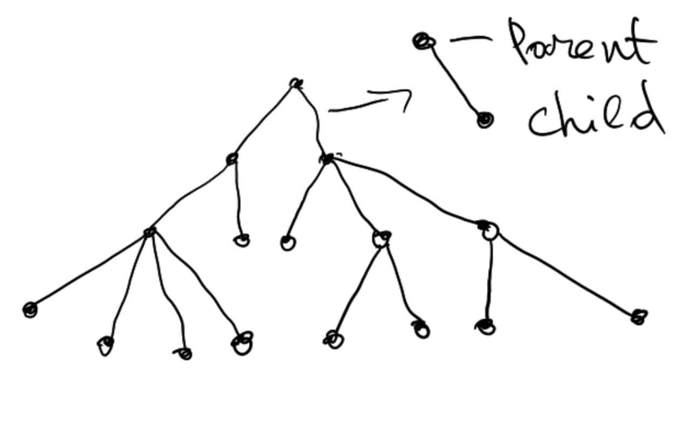

# Exam 1 Tasks
   
## ToDo
1. Write a program to define the people relationships. Parent and childs. See the below image.

People should have **Id, Name, Surname and BirthDate** poperties. Enter the id of person and so we need to find the followings for that person:
 - Who is grandparent of that person
 - Who are the 4rd generation of childs of this person

3. Create 2 console application. \
   1st app should do the followings:
     - Save entered student infos on persistent storage and ask if user want to enter next student info or not
     - If yes, repeat the same step again, if not, just finish the pocess and exit 

    2nd app should do the followings:
     - Wait for student infos on persistent storage which is updated by app1. When new student info appeers here, just visualize it. It just will continue this process endless